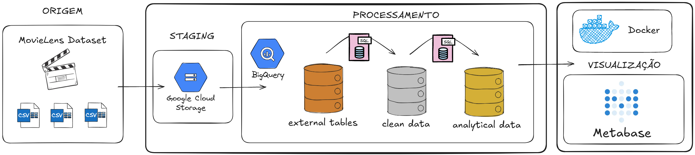
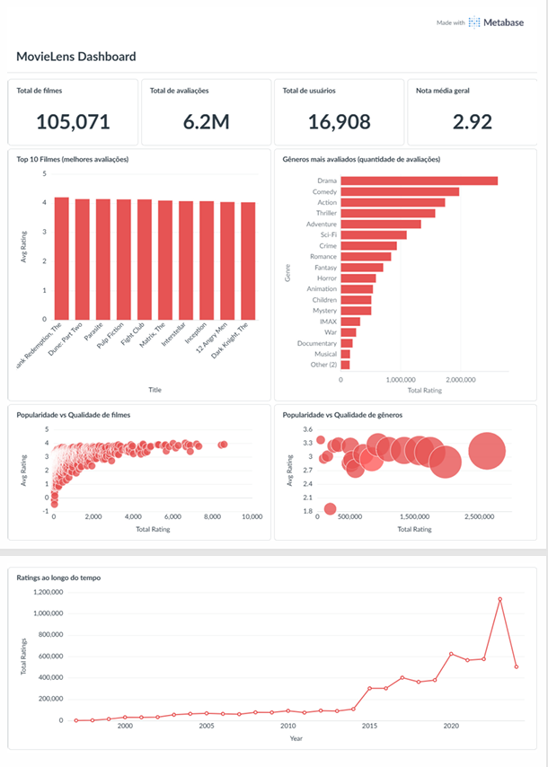

# MovieLens Data Analytics & Engineering

Pipeline de dados end-to-end para ingestão, transformação e análise de mais de 6 milhões de avaliações do dataset MovieLens usando Google Cloud Platform (GCS e BigQuery), SQL, Docker e Metabase.

---

## 📖 Visão Geral
O projeto tem como objetivo construir uma arquitetura de dados escalável e estruturada do dataset.
O pipeline abrange desde a ingestão dos dados brutos até a disponibilização de *insights* visuais. 
* Os arquivos CSV são armazenados em um Data Lake no **Google Cloud Storage (GCS)** e lidos diretamente pelo **Google BigQuery** através de *External Tables*. 
* No BigQuery, os dados passam por um processo de transformação e modelagem (Star Schema), gerando tabelas Fato e Dimensão, além de *Views* analíticas otimizadas.
* Por fim, os dados consolidados são consumidos por um dashboard interativo no **Metabase** (orquestrado localmente via **Docker**).

---

## 🏗️ Arquitetura do Pipeline



**1. Origem e Staging (Data Lake)**
* Os dados brutos do MovieLens (arquivos `.csv`) são armazenados em um *bucket* do **Google Cloud Storage (GCS)**, garantindo um repositório centralizado, barato e seguro para os dados originais.

**2. Processamento e Modelagem (Data Warehouse)**
- Toda a transformação e modelagem ocorre dentro do **Google BigQuery** através de scripts SQL, divididos em três subcamadas:
* **External Tables:** Mapeamento dos arquivos CSV que estão no GCS, permitindo consultar os dados brutos via SQL sem precisar duplicar o armazenamento logo na entrada.
* **Clean Data:** Limpeza, tipagem e estruturação dos dados em um *Star Schema*. Criação da tabela `dim_movies` e da tabela `fact_ratings`.
* **Analytical Data:** Construção de *Views* (`vw_movies_kpis`, `vw_ratings_heatmap`, `vw_top_movies`, `vw_scatter_populatiry_vs_quality`, `vw_user_activity`, `vw_genre_performance`). Essa camada entrega os dados pronto para o consumo de BI, otimizando o custo da *query* e a performance do dashboard.

**3. Visualização de Dados (Business Intelligence)**
* O **Metabase** é utilizado como plataforma de BI. Para garantir o isolamento do ambiente e fácil reprodutibilidade, ele é orquestrado localmente via **Docker** (`docker-compose`).
* A conexão entre o contêiner local e a nuvem do GCP é feita de forma segura via injeção de credenciais (*Application Default Credentials*) como um volume no Docker.

---

## 🛠️ Stack Tecnológica
*   **Cloud Data Lake:** Google Cloud Storage (GCS)
*   **Cloud Data Warehouse:** Google BigQuery (GCP)
*   **Data Processing:** SQL (Standard SQL)
*   **Infrastructure as Code:** Docker (para orquestração de serviços de visualização)
*   **Data Modeling:** Star Schema (Dimensões e Fatos)
*   **Visualization/Consumption:** Metabase (Dashboard para visualização dos dados)

---

## 📁 Estrutura do Repositório

```text
movielens-analytics/
├── sql/
│   ├── external tables/  
│   ├── clean data/       
│   └── analytical data/  
├── data/                 # git ignore
├── docker/               
├── assets/               # Documentação técnica e arquitetura do pipeline
└── gcp-key.json          # Configurações de acesso ao Google Cloud Platform
```

---

## 📊 Dashboard



O resultado permite analisar o comportamento dos usuários e a performance do catálogo de forma clara e objetiva.

---

## ⚙️ Como Reproduzir
**1. Download do dataset**
[MovieLens] (https://grouplens.org/datasets/movielens/ml_belief_2024/)

**2. Configuração do Google Cloud Platform (GCP)**
* Crie um projeto no GCP
* Crie um bucket no Google Cloud Storage (GCS)

**3. Ajuste dos Scripts SQL**
* Na pasta `sql/`, abra os arquivos e substitua os placeholders pelo ID do seu projeto GCP e pelo nome do seu bucket no GCS.

**4. Modelagem no BigQuery**
* Execute os scripts SQL diretamente na interface do BigQuery seguindo a ordem das pastas: 
1. external tables -> 2. clean data -> 3. analytical data.

**5. Executando o Metabase via Docker**
* Gere um arquivo de credenciais do GCP (Application Default Credentials) ou uma Service Account Key e salve na raiz do projeto como gcp-key.json.
* Suba o contêiner do Metabase executando o comando abaixo:
 ```bash
cd docker
docker-compose up -d
 ```
* Acesse http://localhost:3000, conecte o banco de dados escolhendo a opção BigQuery, e aponte para o arquivo JSON configurado no Docker.

---

## 📌 Referência

Este projeto foi desenvolvido como parte do desafio lançado pela comunidade [**Dados Por Todos**](https://www.instagram.com/dadosportodos).

---

## 👩‍💻 Desenvolvido por

- **Nome:** Isadora Torqueti
- **GitHub:** https://github.com/isatorqueti
- **Linkedin:** https://www.linkedin.com/in/isadoratorqueti/